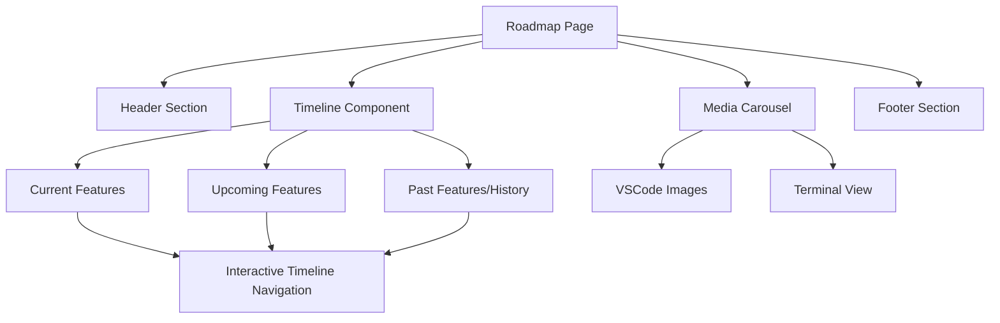
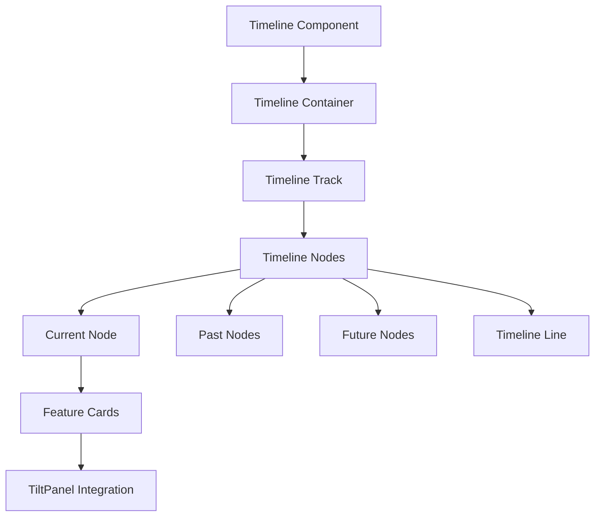
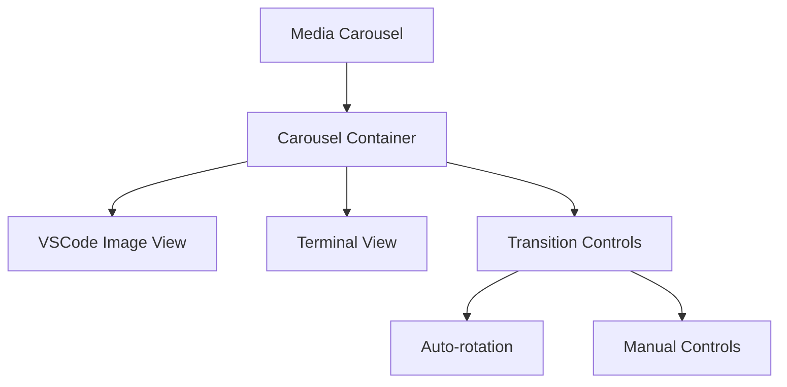

# Roadmap Page Design & Implementation Plan

## Overview

We'll create an on-theme roadmap page that shows a vertical timeline of upcoming features for the next year, with the ability to scroll back to see previous updates. The page will include a carousel that alternates between VSCode images and terminal views, maintaining the site's emerald/dark aesthetic.

## Design Components



## Implementation Steps

### 1. Create Basic Page Structure

1. Create the directory structure:
   ```
   app/blog/roadmap/
   └── page.tsx
   ```

2. Implement the basic page layout following the blog post template structure with header, main content, and footer sections.

### 2. Design and Implement Timeline Component



1. Create a vertical timeline component that:
   - Starts at the top (representing "now")
   - Extends downward for future items
   - Allows scrolling up to see past items
   - Uses the site's emerald accent color for the timeline track
   - Implements fade-in animations for timeline items

2. Style timeline nodes to show:
   - Current features (highlighted with emerald accent)
   - Upcoming features (with estimated dates)
   - Past features (with actual release dates)

3. Implement interactive scrolling that:
   - Defaults to positioning the current feature in view
   - Allows smooth scrolling up and down
   - Highlights the timeline node that's currently in focus

4. Add TiltPanel effects to feature cards for that cool 3D hover effect seen elsewhere on the site.

### 3. Implement Media Carousel



1. Create a carousel component that alternates between:
   - VSCode images (vscode1.png and vscode2.png)
   - The AnimatedTerminal component

2. Implement smooth transitions between views with fade effects.

3. Add auto-rotation with a configurable interval (e.g., 5 seconds).

4. Include manual navigation controls (dots or arrows).

5. Ensure the carousel is responsive and works well on all screen sizes.

### 4. Create Configuration System

1. Implement a configuration system that allows:
   - Setting which timeline step is current
   - Adjusting the carousel rotation speed
   - Toggling auto-rotation

2. Store configuration in a simple JSON structure that can be easily updated.

### 5. Add Animations and Visual Effects

1. Implement fade-in animations for timeline items as they enter the viewport.

2. Add subtle hover effects for interactive elements.

3. Ensure all animations and effects are consistent with the site's existing design language.

4. Use the existing hover-shimmer and glow effects from globals.css for consistency.

## Technical Implementation Details

### Timeline Component

```typescript
interface TimelineItem {
  id: string;
  title: string;
  description: string;
  date: string; // ISO date string
  status: 'past' | 'current' | 'upcoming';
  features: string[]; // List of features in this release
}

interface TimelineProps {
  items: TimelineItem[];
  currentItemId: string;
  onItemFocus?: (itemId: string) => void;
}
```

The Timeline component will:
- Render a vertical line with nodes for each item
- Position items along the timeline based on their dates
- Handle scrolling and focusing on specific items
- Implement intersection observers for fade-in animations

### Media Carousel

```typescript
interface CarouselProps {
  vsCodeImages: string[]; // Paths to VSCode images
  autoRotate?: boolean;
  rotationInterval?: number; // in milliseconds
}
```

The Carousel component will:
- Alternate between VSCode images and the AnimatedTerminal
- Handle automatic rotation with configurable timing
- Provide manual navigation controls
- Implement smooth transitions between views

### Configuration System

```typescript
interface RoadmapConfig {
  currentItemId: string;
  carouselAutoRotate: boolean;
  carouselRotationInterval: number;
}
```

We'll store this configuration in a way that's easy to update, either through:
1. Environment variables
2. A JSON configuration file
3. CMS integration (if available)

## Data Structure for Roadmap Items

We'll use a structured format for roadmap items to make it easy to update:

```typescript
const roadmapItems: TimelineItem[] = [
  {
    id: 'v1.0',
    title: 'Initial Release',
    description: 'First public release of mcpz CLI',
    date: '2025-01-15',
    status: 'past',
    features: [
      'Basic MCP server management',
      'Tool listing and filtering',
      'Command-line interface'
    ]
  },
  {
    id: 'v1.5',
    title: 'Group Management',
    description: 'Intelligent tool grouping and organization',
    date: '2025-02-20',
    status: 'current',
    features: [
      'Create and manage tool groups',
      'Smart group suggestions',
      'Token usage optimization'
    ]
  },
  {
    id: 'v2.0',
    title: 'Cloud Integration',
    description: 'Sync your settings across devices',
    date: '2025-04-15',
    status: 'upcoming',
    features: [
      'Cloud-based configuration',
      'Team sharing capabilities',
      'Advanced analytics'
    ]
  },
  // Additional future releases...
]
```

## Responsive Design Considerations

The roadmap page will be fully responsive:

1. **Desktop View**:
   - Full timeline visible
   - Larger media carousel
   - Side-by-side layout for some sections

2. **Tablet View**:
   - Slightly condensed timeline
   - Properly sized carousel
   - Adjusted spacing

3. **Mobile View**:
   - Vertically stacked layout
   - Smaller timeline nodes
   - Full-width carousel
   - Touch-friendly controls

## Accessibility Considerations

1. Ensure all interactive elements have proper ARIA attributes
2. Maintain sufficient color contrast for text readability
3. Provide keyboard navigation for the timeline and carousel
4. Include alt text for all images
5. Ensure animations can be disabled for users who prefer reduced motion